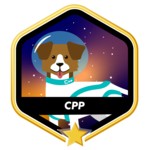

<h2>Hi!</h2>

I'm Martijn Wallage, a software developer currently studying at <a href="https://42berlin.de">42 Berlin</a>.

- I’m developing my skills in **C**, **C++**, **Python**, and **JavaScript**.
  
- I’m currently working on ft_transcendence, the final project of the 42 Core Curriculum.

- You can reach me at mwallage@student.42berlin.de.

- I made this cv - <a href="https://martijnwallage.github.io">https://martijnwallage.github.io</a> - in HTML and CSS.

- Aside from coding, I am a writer and philosopher. On my <a href="https://www.martijnwallage.nl">personal website</a> you can find some of my writings.

<h3>Connect with me</h3>

<h3>Tech Stack</h3>

<h3>42 Projects</h3>

)

