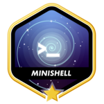
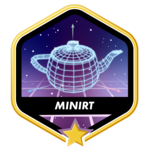
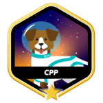

<h2>Hi!</h2>

I'm Martijn Wallage, a software developer and writer/philosopher. 

- I completed the Core Curriculum of <a href="https://42berlin.de">42 Berlin</a>.

- Although I live in Oxford, I am an Advanced Student at Codam, Amsterdam. You can reach me at mwallage@student.codam.nl.

- I am looking to collaborate on [Thales](https://github.com/MartijnWallage/Thales), a project to model all sorts of things (urban growth, immigration, economy, wars, climate change, natural disasters) using cellular automata.
 
- Aside from coding, I am a writer and philosopher. On my <a href="https://www.martijnwallage.nl">personal website</a> and on my <a href="https://martijnwallage.substack.com">Substack</a> you can read my literary prose and poems.

<h3>Connect with me</h3>

<h3>Tech Stack</h3>

<h3>42 Projects</h3>

